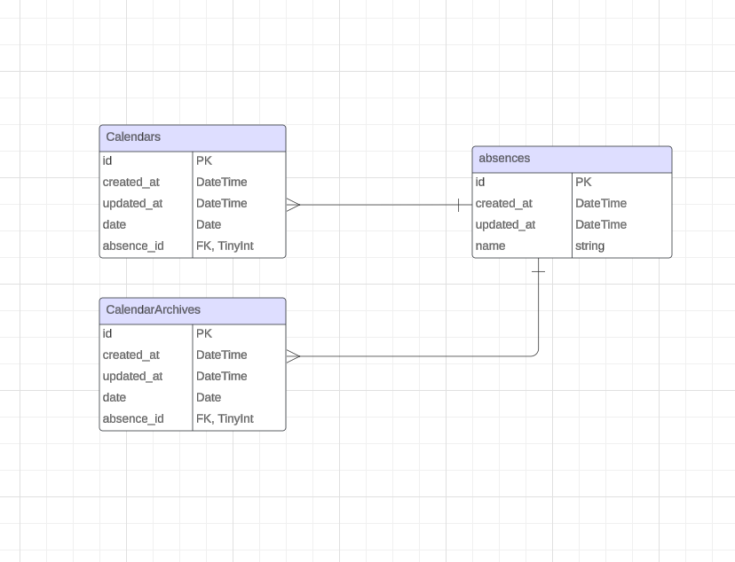

# Teneo Absence Tracker

## Description

Teneo Absence Tracker is a project developed as part of a testing task for the company Teneo. This project allows tracking and archiving worker absences in a dynamic calendar.

## Technologies

- Laravel 11
- Vue 3
- Bootstrap 5
- MySQL

## Installation

1. Clone the repository to your local machine using `git clone`.
2. Navigate to the project directory and install PHP packages using `composer install`.
3. Copy the `.env.example` file and rename it to `.env`. Configure the MySQL database connection.
4. Install composer packages using `composer install`.
5. Run the migrations to create the database tables: `php artisan migrate`.
6. Install npm packages using `npm install`.
7. Run the application with `php artisan serve` for the backend and `npm run dev` for the frontend.

##ER Diagram

